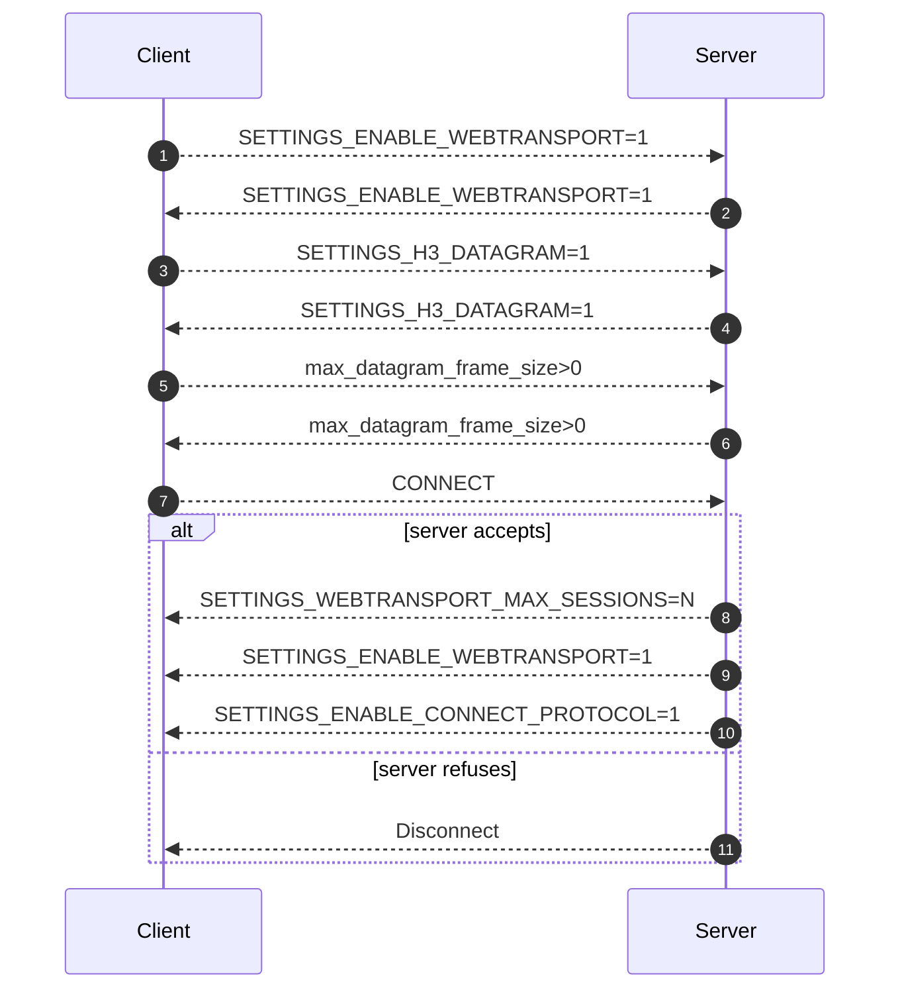

# Transport

Server implementation of the WebTransport over HTTP/3 in Python.

## WebTransport Architecute

> WebTransport [OVERVIEW] is a protocol framework that enables clients constrained by the Web security model to communicate with a remote server using a secure multiplexed transport. This document describes a WebTransport protocol that is based on HTTP/3 [HTTP3] and provides support for unidirectional streams, bidirectional streams and datagrams, all multiplexed within the same HTTP/3 connection.

Source: [draft-ietf-webtrans-http3-06 (Internet-Draft)](https://datatracker.ietf.org/doc/html/draft-ietf-webtrans-http3/#section-abstract-1)

Suequence Diagram (**In Progress**)

